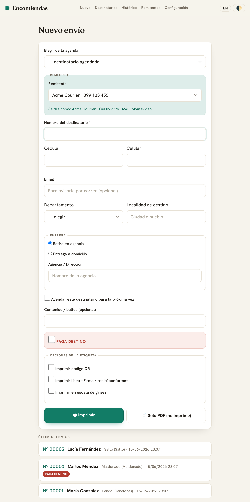
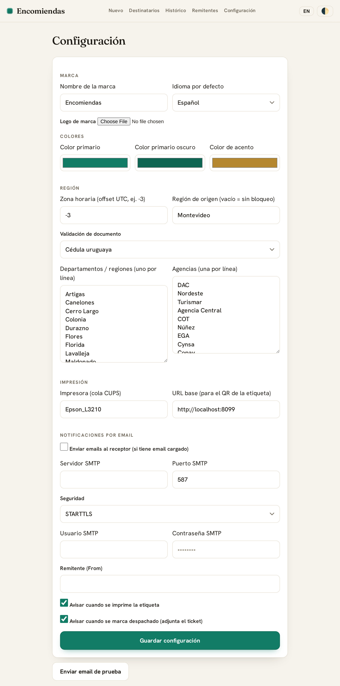
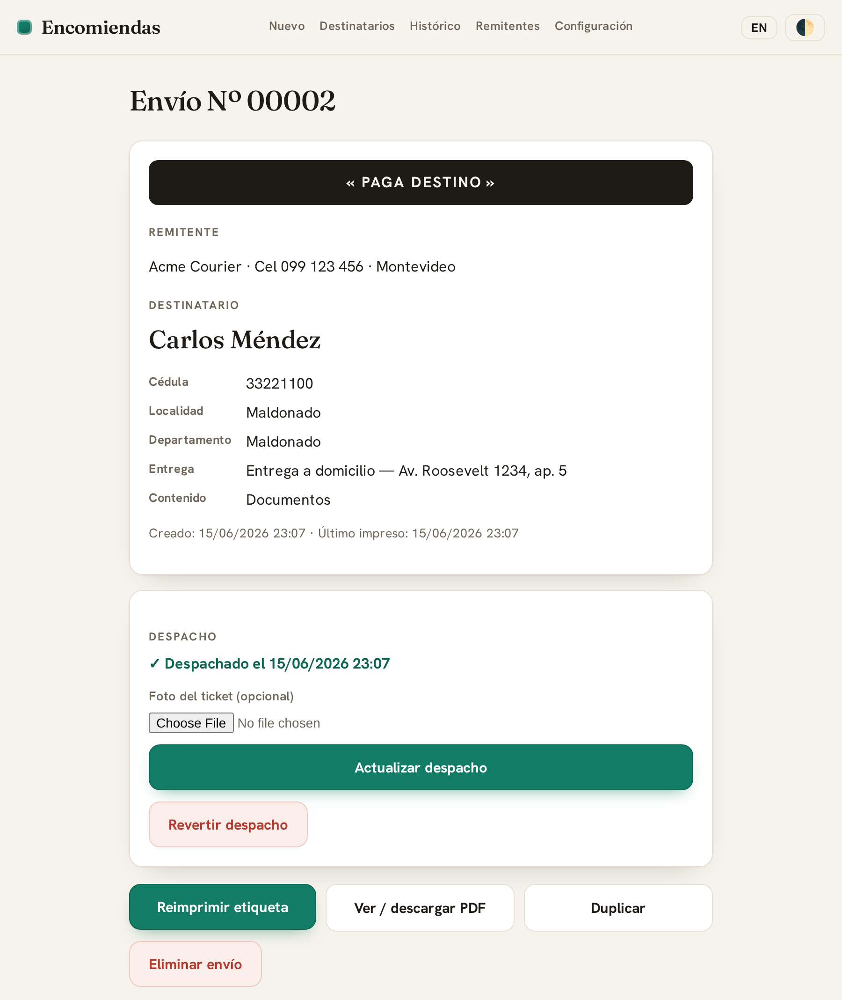
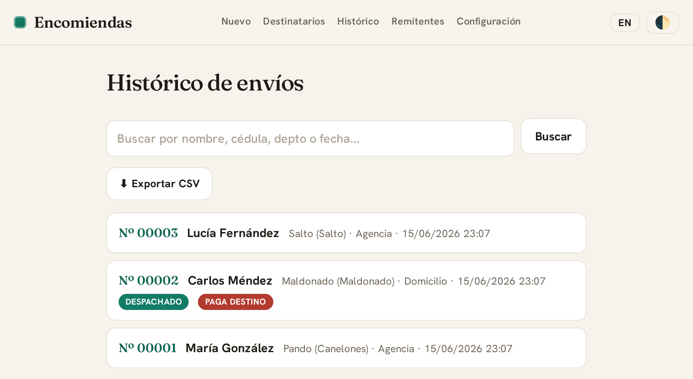
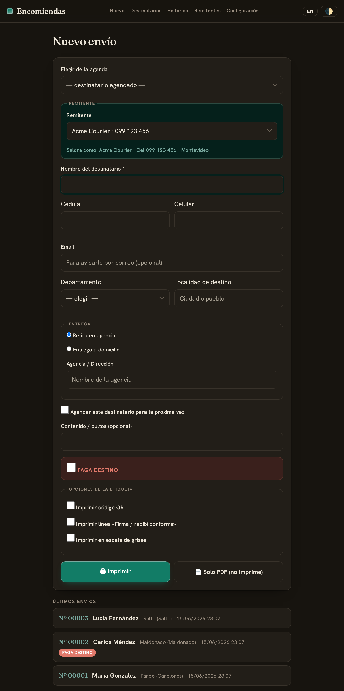

# Etiquetas de Encomiendas · Parcel Labels

[](LICENSE)


[Español](#español) · [English](#english)

Self-hosted web app to create and print **parcel/shipping labels** (A4 PDF) from
your phone or desktop, with a printable QR, an address book, dispatch tracking
with a receipt photo, CSV export, and optional **email notifications** to the
recipient. Everything (brand, senders, regions, agencies, printer, language,
SMTP) is configured from an **admin screen** — no code editing.

Bilingual **es/en**. Ships with a Uruguay preset (departments, courier agencies,
national-ID check digit) that you can edit or replace.

## Screenshots

<table>
  <tr>
    <td align="center" width="50%">
      <br>
      <sub>Nuevo envío · <i>New shipment</i></sub>
    </td>
    <td align="center" width="50%">
      <br>
      <sub>Configuración · <i>Settings</i></sub>
    </td>
  </tr>
  <tr>
    <td align="center" width="50%">
      <br>
      <sub>Detalle + despacho · <i>Detail + dispatch</i></sub>
    </td>
    <td align="center" width="50%">
      <br>
      <sub>Histórico · <i>History</i></sub>
    </td>
  </tr>
</table>

<details>
<summary>🌙 Modo oscuro · <i>Dark mode</i></summary>


</details>

---

## Español

### Funciones
- Alta de envíos con **remitente seleccionable** (CRUD, con logo opcional por
  remitente) y destinatario (documento, celular, email, región, localidad,
  agencia/domicilio). Los nombres se normalizan a Mayúsculas Iniciales y el
  documento/celular a sólo dígitos.
- **Etiqueta PDF** (ReportLab) con QR opcional, banner *PAGA DESTINO*, línea de
  firma y el logo del remitente. Formato en escala de grises (el logo va a color).
- Impresión directa vía `lp` (CUPS) o descarga del PDF.
- **Histórico** con búsqueda, reimpresión, duplicado, borrado y **export CSV**.
- **Agenda de destinatarios** con autocompletado por documento/celular.
- **Despacho**: marcar como despachado y adjuntar **foto del ticket**.
- **Notificaciones por email** al receptor (si tiene email): al crear el envío
  (primera impresión, no en reimpresiones) y al despachar (adjunta la foto del
  ticket). Opcional, por SMTP. Cada remitente puede tener su **propia cuenta
  saliente** (From + usuario/clave SMTP); si no, usa la cuenta global.
- **Modo oscuro** y **bilingüe** (es/en), conmutables desde el encabezado.
- Marca y paleta configurables; **guard de origen** opcional (no enviar al mismo
  departamento que el remitente) y **validación de documento** pluggable.

### Correr
```bash
cp .env.example .env      # editá SECRET_KEY
docker compose up -d --build
# http://localhost:8088
```
Ajustá `user:` en `docker-compose.yml` a tu uid/gid (`id -u` / `id -g`) para que
`./data` quede de tu propiedad. La impresión usa el CUPS del host montado en
`/run/cups`; en `/admin` configurá el nombre de la cola.

### Configuración (`/admin`)
Marca (nombre, logo, colores), idioma por defecto, zona horaria, región de origen,
validación de documento, lista de regiones y agencias, impresora, URL base (para el
QR) y SMTP. Los valores por defecto son un preset de Uruguay; cambialos a gusto.

### Notas
- La impresión en gris usa `-o Ink=MONO` (varios drivers Epson `escpr` ignoran el
  estándar `print-color-mode`).
- Sin autenticación: pensada para una LAN privada. Si la exponés, poné un proxy con
  auth delante.

---

## English

### Features
- Shipments with a **selectable sender** (CRUD, optional per-sender logo) and a
  recipient (ID, phone, email, region, locality, agency/home). Names are
  normalized to Title Case and ID/phone to digits only.
- **PDF label** (ReportLab) with optional QR, a *RECIPIENT PAYS* banner, a
  signature line and the sender's logo. Grayscale layout (logo keeps color).
- Direct printing via `lp` (CUPS) or PDF download.
- **History** with search, reprint, duplicate, delete and **CSV export**.
- **Recipient address book** with autocomplete by ID/phone.
- **Dispatch**: mark as dispatched and attach a **receipt photo**.
- **Email notifications** to the recipient (when an email is set): when the
  shipment is created (first print, not on reprints) and when dispatched
  (attaches the receipt photo). Optional, over SMTP. Each sender can have its
  **own outgoing account** (From + SMTP user/password); otherwise the global one.
- **Dark mode** and **bilingual** (es/en), toggled from the header.
- Configurable brand and palette; optional **origin guard** (don't ship to the
  sender's own region) and a pluggable **ID validation**.

### Run
```bash
cp .env.example .env      # set SECRET_KEY
docker compose up -d --build
# http://localhost:8088
```
Set `user:` in `docker-compose.yml` to your uid/gid so `./data` is yours. Printing
uses the host CUPS mounted at `/run/cups`; set the queue name in `/admin`.

### Configuration (`/admin`)
Brand (name, logo, colors), default language, time zone, origin region, ID
validation, region and agency lists, printer, base URL (for the QR) and SMTP.
Defaults ship as a Uruguay preset — change them freely.

### Notes
- Grayscale printing uses `-o Ink=MONO` (several Epson `escpr` drivers ignore the
  standard `print-color-mode`).
- No authentication: meant for a private LAN. If you expose it, put an
  auth proxy in front.

### Adding a language
Edit `i18n.py`: copy the `es` dict to a new key (e.g. `pt`), translate the values,
and it shows up in the language switcher. The PDF and emails follow the language too.

### Stack
Flask + gunicorn · SQLite · ReportLab · Pillow · qrcode · Docker Compose.

### Tests
```bash
pip install -r requirements-dev.txt
pytest
```
